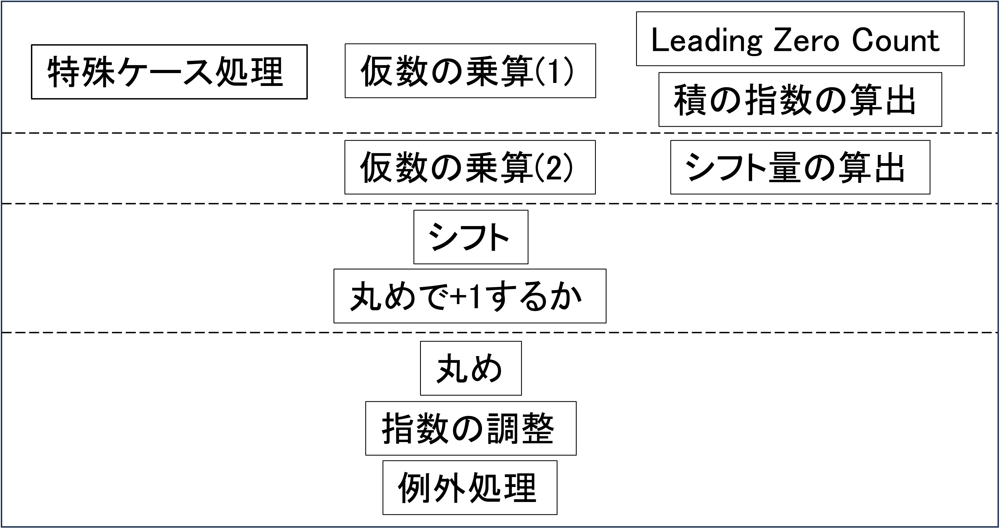
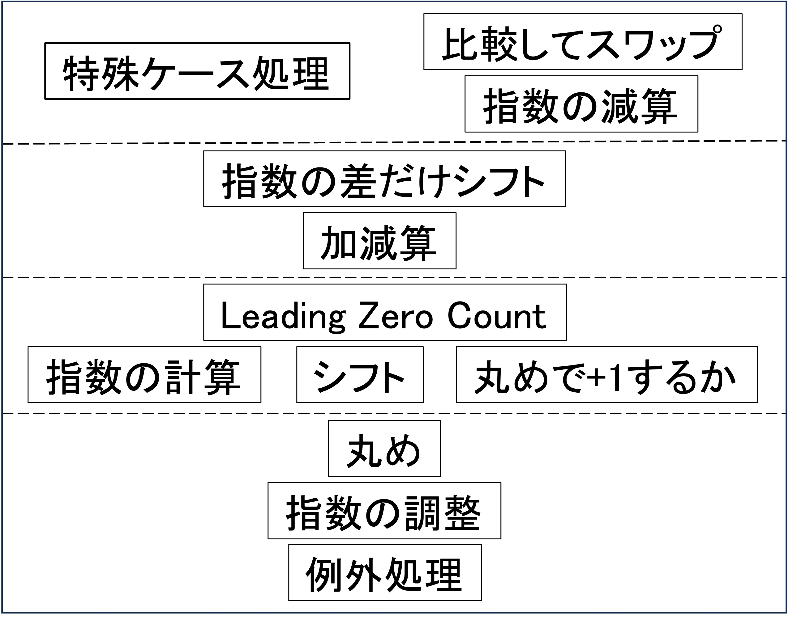

# 浮動小数点演算器
Verilogで書いたRISC-VとIEEE754に準拠した単精度浮動小数点演算器です。

## FP32乗算器
### 基本方針
#### 指数部の和と仮数部の積を求める

- 指数部には127のゲタがあるため指数部の和から127を引いて積の指数を算出

- 指数部が0の非正規仮数は仮数部の積の先頭に0が連続し、積を正規化するためには先頭の0のカウント（Leading Zero Count)や長いシフトが必要

- 入力の仮数部の Leading Zero Count を行うことで仮数の乗算と並列にシフト量を算出、指数も調整

以下のような4ステージのパイプラインとなっている。

## FP32加算器
### 基本方針
#### 入力の大きさを比較してスワップし、小さい方の入力を指数の差だけ右シフト

- 入力の符号部の排他的論理和をとることで実質的な加算か減算か判定

- 指数の差が0か1しかない場合は減算で複数bitの桁落ちが発生する可能性があり Leading Zero Count とシフトが必要

- 加算においては１bitの桁上がり、減算においては桁下がりが発生する可能性があるため、加減算後の処理を等しくするために加算の入力は1bit右シフト

以下のような4ステージのパイプラインとなっている。

